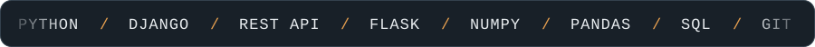
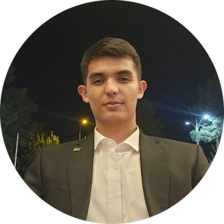

  

  
  
  
  

  

I build clean, maintainable server-side applications with Python and Django and connect AI models to real products. Open to Python / Django backend and AI roles.

Я создаю чистые, поддерживаемые серверные приложения на Python и Django и подключаю ИИ-модели к реальным продуктам. Открыт к предложениям по Python / Django backend и ИИ.

 

Click a section to open it. &nbsp;/&nbsp; Нажмите на раздел, чтобы раскрыть его.

<b>English</b>

### About

Python developer with hands-on experience in backend development with Django and in working with artificial intelligence. Strong foundation in object-oriented programming, data structures and algorithms. I study Computer Science and Information Technology, major in Artificial Intelligence and Expert Systems.

### Stack

How a Django + AI request flows

What I work on

- **Backend with Django:** models and database schemas through the ORM, views and APIs, authentication, the admin panel.
- **Artificial intelligence:** working with data and AI models in Python with NumPy and Pandas, wiring AI features into backend services.
- **Engineering fundamentals:** clean code, object-oriented design, algorithms and data structures, testing and debugging.

Education

**Oguz han Engineering and Technology University of Turkmenistan**, Ashgabat, 2022 – present
Faculty: Computer Science and Information Technology
Major: Artificial Intelligence and Expert Systems

Contact

- Email: nazarhezretkuliev@gmail.com
- Phone: +99362972556
- Location: Ashgabat, Turkmenistan
- Languages: English, Russian, Turkmen
- CV: [English (PDF)](cv/Nazar_Hezretkuliev_Resume_EN.pdf) · [Русский (PDF)](cv/Nazar_Hezretkuliev_Resume_RU.pdf)

<b>Русский</b>

### Обо мне

Python-разработчик с практическим опытом backend-разработки на Django и работы с искусственным интеллектом. Крепкая база в объектно-ориентированном программировании, структурах данных и алгоритмах. Учусь на факультете «Компьютерные науки и информационные технологии», специальность «Искусственный интеллект и экспертные системы».

### Стек

Путь запроса Django + ИИ

Чем занимаюсь

- **Backend на Django:** модели и схемы БД через ORM, представления и API, аутентификация, админ-панель.
- **Искусственный интеллект:** работа с данными и ИИ-моделями на Python (NumPy, Pandas), подключение ИИ-функций к backend-сервисам.
- **Основы разработки:** чистый код, ООП, алгоритмы и структуры данных, тестирование и отладка.

Образование

**Инженерно-технологический университет Туркменистана имени Огуз хана**, Ашхабад, 2022 – настоящее время
Факультет: Компьютерные науки и информационные технологии
Специальность: Искусственный интеллект и экспертные системы

Контакты

- Email: nazarhezretkuliev@gmail.com
- Телефон: +99362972556
- Город: Ашхабад, Туркменистан
- Языки: английский, русский, туркменский
- Резюме: [English (PDF)](cv/Nazar_Hezretkuliev_Resume_EN.pdf) · [Русский (PDF)](cv/Nazar_Hezretkuliev_Resume_RU.pdf)

